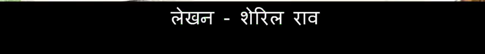
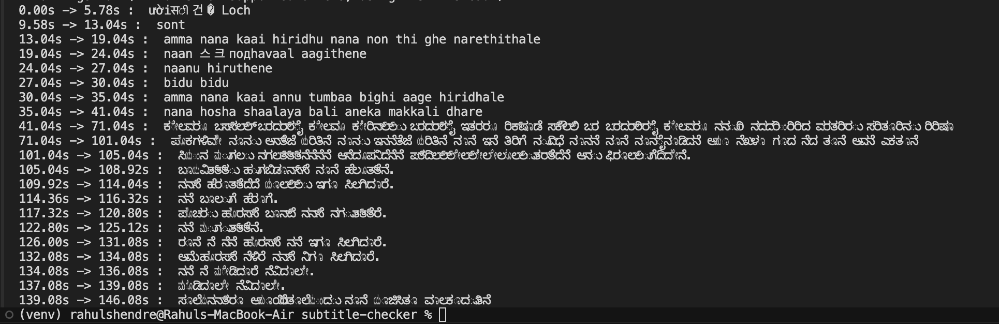
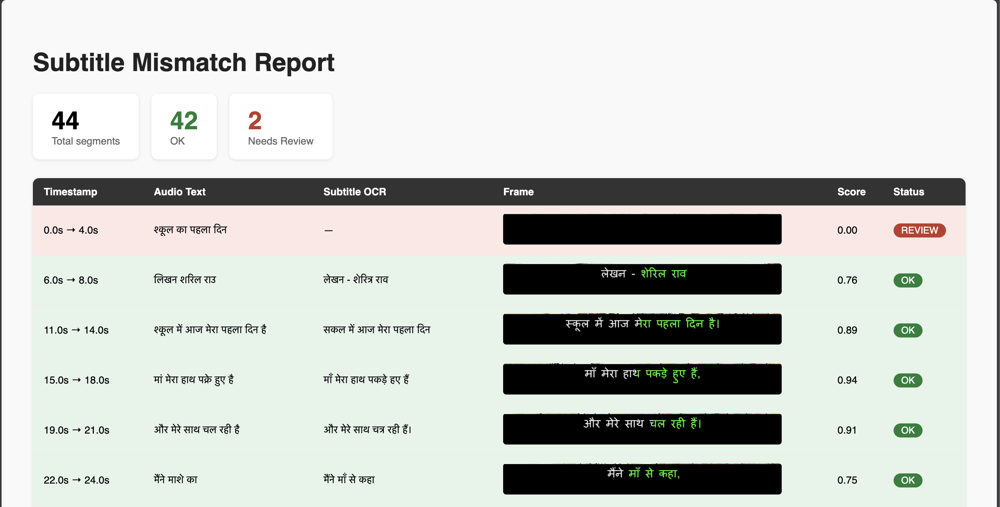

# Burn-in Subtitle Checker

Detects mismatches between spoken audio and burned-in subtitles in video files.

Built as a prototype for [PlanetRead](https://planetread.org) C4GT DMP 2026.

## Video used 

[](https://www.youtube.com/watch?v=PmM5Fy3RLkc)

## Pipeline

1. Transcribes audio with Whisper
2. Captures subtitle region from video frames with OpenCV
3. Reads subtitle text with Tesseract OCR (Hindi)
4. Compares both texts with RapidFuzz and flags mismatches

## Language support

Check other languages by switching branches.

- Hindi: best supported right now.
- Kannada: supported, but ASR is noisy and mismatch scores are less stable.
- Marathi: supported, but early segments misread and OCR alignment is drifting 

Work in progress...


## Screenshots

### Subtitle region crop



### Terminal output



### HTML report



## Setup

You need **Python 3.9+** and **Tesseract OCR** with **Hindi** language data (`hin`).

### Tesseract — macOS

```bash
brew install tesseract tesseract-lang
```

### Tesseract — Windows

Install from [UB Mannheim](https://github.com/UB-Mannheim/tesseract/wiki) or run `winget install --id UB-Mannheim.TesseractOCR`. Enable Hindi during install and keep Tesseract on your PATH.

### Python dependencies

**macOS / Linux**

```bash
python3 -m venv venv
source venv/bin/activate
pip install openai-whisper opencv-python pytesseract rapidfuzz
```

**Windows:** `python -m venv venv`, then `venv\Scripts\activate`, then `pip install openai-whisper opencv-python pytesseract rapidfuzz`.

## Usage

```bash
python3 transcribe.py   # transcribe audio
python3 ocr_frame.py    # test OCR on one frame
python3 checker.py      # run full pipeline
python3 report.py       # generate HTML report
```

On Windows use `python` instead of `python3` if that is how Python is installed.

## Author

Rahul Shendre — [GitHub](https://github.com/rahulshendre) · [LinkedIn](https://www.linkedin.com/in/rahul-shendre/)
